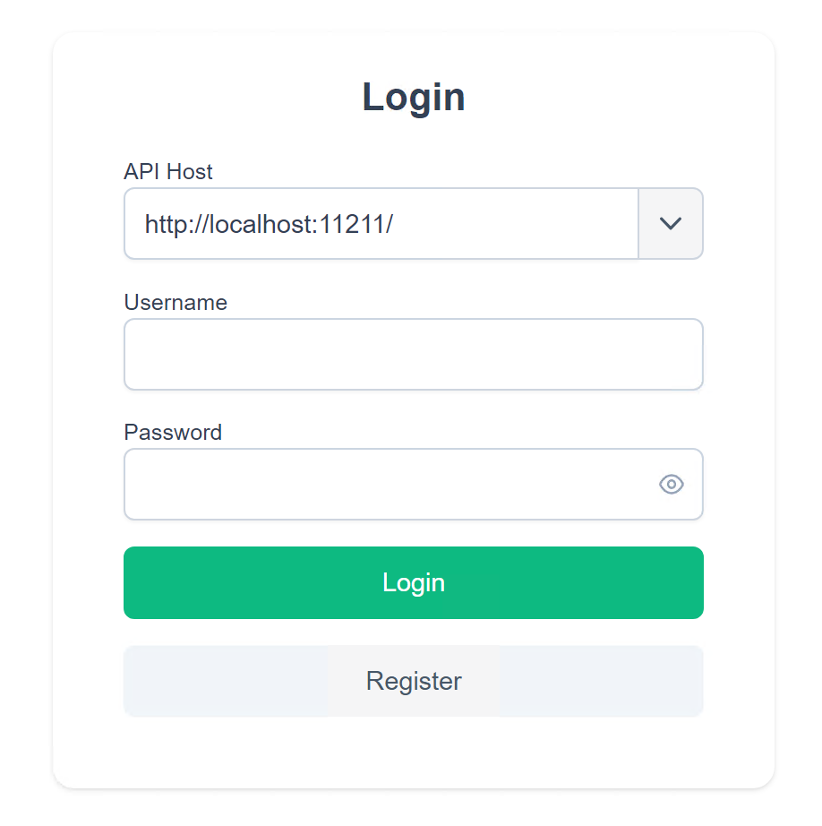

# Wyse5070安装fedora43 Server
## 机器配置
主机：Wyse 5070 Thin Client <br>
CPU：Intel(R) Celeron(R) J4105 (4) @ 2.50 GHz <br>
GPU：Intel UHD Graphics 600 @ 0.75 GHz <br>
RAM：SK Hynix 4G<br>

## 目的
给Wyse 5070瘦客户机安装fedora43 Server，配置Knock敲门，用于节点服务，流量转发，反向代理。

## 开始
### 下载fedora43 Server
fedora官方下载地址（会重定向到镜像站）：https://download.fedoraproject.org/pub/fedora/linux/releases/43/Server/x86_64/iso/Fedora-Server-dvd-x86_64-43-1.6.iso <br>
fedora官方下载地址（BitTorrent）：https://fedoraproject.org/torrents/43/ <br>
### 刷写fedora43 Server
本人使用Ventoy，直接把镜像放进去刷好Ventoy的移动硬盘里就行<br>
Ventoy项目地址：https://github.com/ventoy/Ventoy<br>
选择移动硬盘启动后，跟着操作指引安装系统就行，fedora的安装已经足够宝宝巴士了。<br>
### 系统配置
#### 更换镜像源
使用一键脚本更换软件源，选择中科大镜像并进行软件源更新
```
#如果是root就不需要这条命令
sudo -i 
```
```
bash <(curl -sSL https://linuxmirrors.cn/main.sh)
```
紧接着用一键脚本更换docker源
```
bash <(curl -sSL https://linuxmirrors.cn/docker.sh)
```
#### 移除Web Console里的root用户限制
先安装编辑器，我两个都装但是我用nano
```
sudo dnf install nano vim
```
接着打开/etc/cockpit/disallowed-users
```
sudo nano /etc/cockpit/disallowed-users
```
用#号将root注释掉，ctrl+x退出并保存即可
### 软件安装与配置
#### 安装Easytier
拉取我自己构建的easytier-web-embed docker镜像
```
cd /opt
git clone -b docker-web-embed --single-branch https://github.com/404-GCross/EasyTier.git easytier-docker
cd easytier-docker
```
部署镜像
```
docker build -f Dockerfile.web-embed -t easytier-web-embed .
```
启动容器
```
docker run -d \
  --name easytier-web \
  --restart unless-stopped \
  -p 11211:11211 \
  -p 22020:22020/udp \
  -v easytier-data:/app \
  easytier-web-embed
```
接着机器安装easytier-core容器
```
docker run --name easytier-core -d \
    --network host \
    -e TZ=Asia/Shanghai \
    -v /etc/machine-id:/etc/machine-id \
    --privileged \
    --restart=always \
    easytier/easytier:latest \
    -w udp://127.0.0.1:22020/yourusername
```
根据自己需求替换掉其中的yourusername，运行命令即可完成部署。
然后用http://<对应的IP>:11211来访问网页控制台

将里面的localhost替换为登录该web界面用的IP，然后输入点击Register输入账号密码注册，如果API Host不正确验证码图片是加载不出来的<br>
注册完成后在login界面输入刚刚注册的账号密码登录<br>
登录之后点击左侧的Device List，如果部署正确则会有一台设备连接上，点击齿轮对其进行配置下发就可以了，这里就不赘述了。


#### 安装Dpanel来管理docker容器
使用官方的一键脚本
```
curl -sSL https://dpanel.cc/quick.sh | bash
```
运行后跟随指引安装就行。
#### 安装openlist用于管理网盘映射
```
mkdir -p /etc/openlist
docker run --user $(id -u):$(id -g) -d --restart=unless-stopped -v /etc/openlist:/opt/openlist/data -p 5244:5244 -e UMASK=022 --name="openlist" openlistteam/openlist:latest
```
反正只用来映射网盘，直接照抄官方配置<br>
部署完之后直接用命令修改默认密码
```
docker exec -it openlist ./openlist admin set 123456
```
然后网页登录openlist进去修改密码
#### 配置网盘
115网盘使用115开放平台接入：
https://doc.oplist.org.cn/guide/drivers/115_open <br>
天翼云盘：https://doc.oplist.org.cn/guide/drivers/189 <br>


#### 安装Knock敲门
使用官方最小Docker Compose最小部署教程
```
mkdir -p /opt/fn-knock-docker
cd /opt/fn-knock-docker
```
准备.env文件
```
sudo nano .env
```
```
FN_KNOCK_IMAGE=kcilnk/fn-knock:latest
TZ=Asia/Shanghai
ADMIN_VIEW_PORT=7991
BACKEND_PORT=7998
AUTH_PORT=7997
GO_BACKEND_PORT=7996
GO_REPROXY_PORT=7999
FN_KNOCK_DOCKER_IPV4_SUBNET=172.30.0.0/16
FN_KNOCK_DOCKER_IPV6_SUBNET=fd42:fb33:7f7a:100::/64
DOCKER_ADMIN_TRUSTED_PROXY_CIDRS=
DOCKER_DISCOVER_LAN_IP=
```
准备compose文件
```
nano docker-compose.yml
```
```
services:
  fn-knock:
    image: ${FN_KNOCK_IMAGE}
    restart: unless-stopped
    environment:
      TZ: ${TZ:-Asia/Shanghai}
      FN_KNOCK_RUNTIME_TARGET: docker
      REDIS_HOST: redis
      REDIS_PORT: 6379
      FN_KNOCK_DATA_DIR: /var/lib/fn-knock
      FN_KNOCK_GATEWAY_CONFIG_DIR: /usr/local/etc/fn-knock
      ADMIN_VIEW_PORT: ${ADMIN_VIEW_PORT:-7991}
      BACKEND_PORT: ${BACKEND_PORT:-7998}
      AUTH_PORT: ${AUTH_PORT:-7997}
      GO_BACKEND_PORT: ${GO_BACKEND_PORT:-7996}
      GO_REPROXY_PORT: ${GO_REPROXY_PORT:-7999}
      DOCKER_ADMIN_TRUSTED_PROXY_CIDRS: ${DOCKER_ADMIN_TRUSTED_PROXY_CIDRS:-}
      DOCKER_DISCOVER_LAN_IP: ${DOCKER_DISCOVER_LAN_IP:-}
      DDNS_HOST_IF_INET6_PATH: /host/proc/net/if_inet6
      ADMIN_VIEW_HOST: 0.0.0.0
      BACKEND_HOST: 127.0.0.1
    ports:
      - "${ADMIN_VIEW_PORT:-7991}:${ADMIN_VIEW_PORT:-7991}"
      - "${GO_REPROXY_PORT:-7999}:${GO_REPROXY_PORT:-7999}"
    networks:
      - fn_knock_net
    volumes:
      - fn_knock_data:/var/lib/fn-knock
      - fn_knock_gateway:/usr/local/etc/fn-knock
      - /proc/1/net:/host/proc/net:ro
    depends_on:
      redis:
        condition: service_healthy
    healthcheck:
      test:
        [
          "CMD-SHELL",
          "curl -fsS http://127.0.0.1:${ADMIN_VIEW_PORT:-7991}/api/admin/healthz || exit 1",
        ]
      interval: 10s
      timeout: 5s
      retries: 12
      start_period: 20s

  redis:
    image: redis:7-bookworm
    restart: unless-stopped
    environment:
      TZ: ${TZ:-Asia/Shanghai}
    command: ["redis-server", "--appendonly", "yes"]
    networks:
      - fn_knock_net
    volumes:
      - fn_knock_redis:/data
    healthcheck:
      test: ["CMD", "redis-cli", "ping"]
      interval: 5s
      timeout: 3s
      retries: 20

volumes:
  fn_knock_data:
  fn_knock_gateway:
  fn_knock_redis:

networks:
  fn_knock_net:
    enable_ipv6: true
    ipam:
      config:
        - subnet: ${FN_KNOCK_DOCKER_IPV4_SUBNET:-172.30.0.0/16}
        - subnet: ${FN_KNOCK_DOCKER_IPV6_SUBNET:-fd42:fb33:7f7a:100::/64}
```


启动
```
docker compose pull
docker compose up -d
```
如果发现连不上就看日志排障
```
docker compose ps
docker compose logs -f fn-knock
```
### 安装uptime-kuma
直接运行下面这行命令
```
docker run -d --restart=always -p 3001:3001 -v uptime-kuma:/app/data --name uptime-kuma louislam/uptime-kuma:2
```
然后用服务器IP:3001登录即可


## 本篇涉及的项目：<br>
https://github.com/donknap/dpanel <br>
https://github.com/OpenListTeam/OpenList <br>
https://github.com/kci-lnk/fn-knock-turborepo <br>


